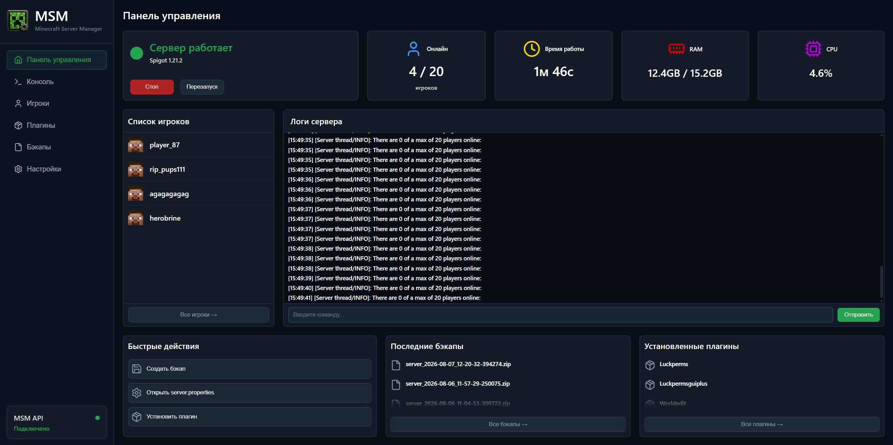
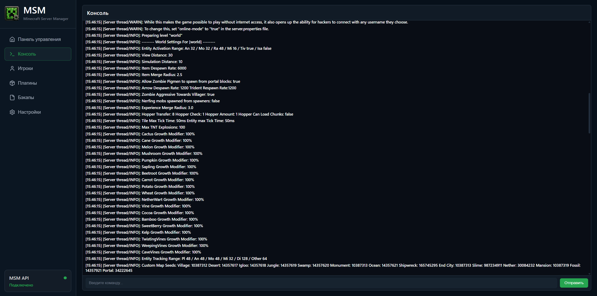
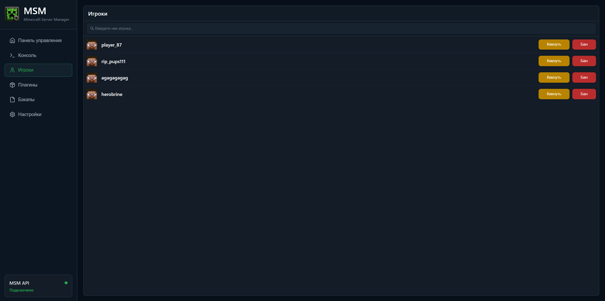
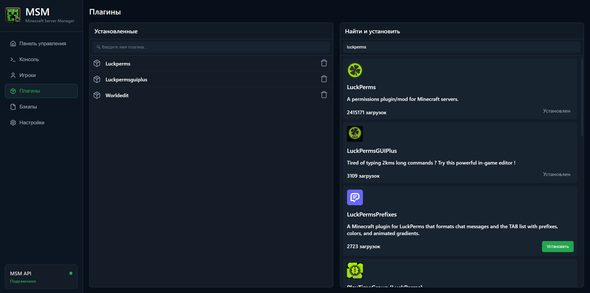
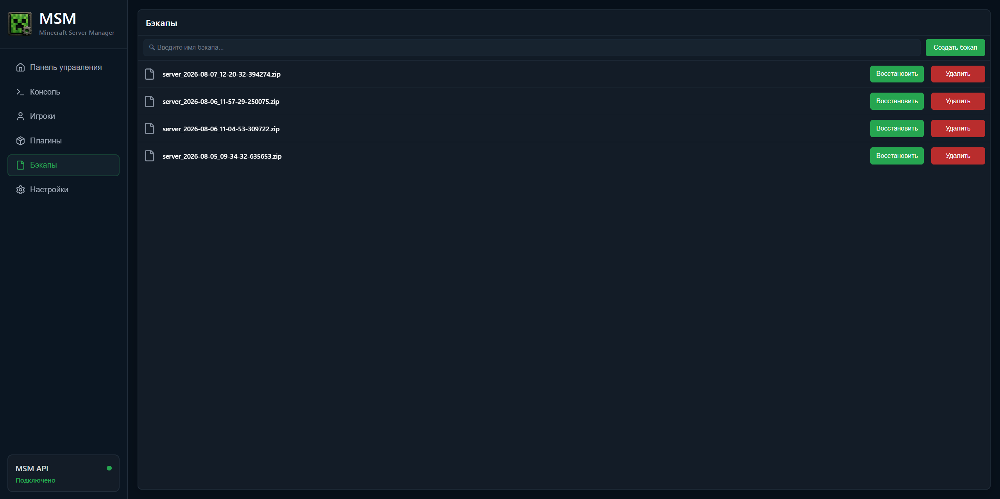
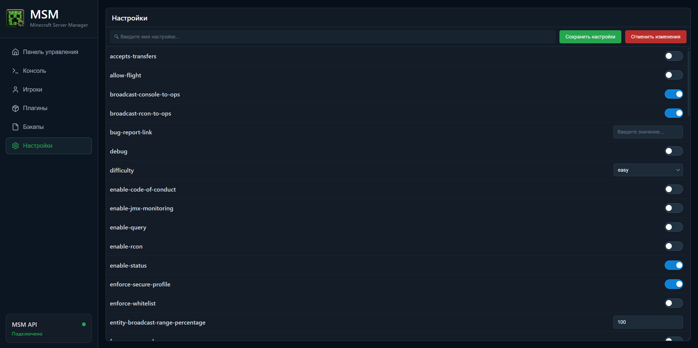

<div align="center">
  

# ⛏️ Minecraft Server Manager

**Локальная панель управления Minecraft-сервером**


</div>

## 📄 Описание

**Minecraft Server Manager (MSM)** — это fullstack-приложение для локального управления Minecraft-сервером через веб-интерфейс.

MSM объединяет backend на **FastAPI** и интерактивный frontend на **React**, позволяя управлять сервером, просматривать логи и состояние, работать с резервными копиями и плагинами, а также изменять настройки сервера прямо из панели.

## 📌 Скриншоты


<br></br>

<br></br>

<br></br>

<br></br>

<br></br>


## ✨ Возможности

* 🖥️ **Управление сервером** — запуск, остановка, перезапуск и выполнение команд через веб-консоль.
* 📊 **Мониторинг** — статус сервера, игроки, версия Minecraft, uptime, использование RAM и CPU.
* 📜 **Логи в реальном времени** — потоковая передача логов через WebSocket прямо в интерфейс.
* 💾 **Резервные копии** — создание, восстановление и удаление backup-файлов.
* 🔌 **Управление плагинами** — поиск плагинов через Modrinth, просмотр информации, установка и удаление.
* ⚙️ **Настройки сервера** — редактирование `server.properties` и управление EULA прямо из веб-интерфейса.

## 🛠️ Технологии

**Backend:** Python 3.14, FastAPI, Uvicorn, HTTPX, WebSocket, Poetry, Pytest, Ruff, Mypy

**Frontend:** React, Vite, JavaScript, CSS, Lucide React

## 📊 Качество проекта

🧪 **Покрытие тестами:** 80%

🛠️ **Ruff** используется для линтинга и форматирования, **Mypy** — для статической проверки типов.

🏗️ Backend разделён на HTTP-слой и бизнес-логику с использованием сервисной архитектуры и Dependency Injection.

## 📋 Требования

Для запуска проекта понадобятся:

* **Python 3.14**
* **Poetry**
* **Node.js**
* **npm**
* Установленный Minecraft-сервер

## 🚀 Запуск

### 1. Клонировать репозиторий

```bash
git clone https://github.com/ksredkin/minecraft-server-manager
cd minecraft-server-manager
```

### 2. Установить зависимости backend

```bash
poetry install --only main
```

### 3. Настроить backend

Укажите путь к Minecraft-серверу и параметры его запуска в:

```text
src/api/core/config.py
```

### 4. Запустить API

```bash
poetry run python -m src.api
```

API будет доступен по адресу:

```text
http://127.0.0.1:8000
```

Swagger UI:

```text
http://127.0.0.1:8000/docs
```

### 5. Запустить frontend

```bash
cd ./src/frontend
npm install
npm run dev
```

После запуска откройте адрес, который выведет Vite в консоли.

## ⭐ Поддержка

Если проект оказался интересным или полезным — поставьте ⭐ на GitHub!
